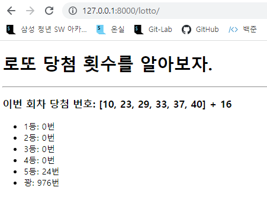

# Django Web Framework

아래와 같은 양식으로 결과 사진과 views.py, urls.py, lotto.html 파일의 코드를 별도의 마크다운 파일에 작성하여 제출하시오.



1. views.py

```python
from django.shortcuts import render
import requests
import random

# Create your views here.
def index(request):
    url = "https://www.dhlottery.co.kr/common.do?method=getLottoNumber&drwNo=1"
    lotto_data = requests.get(url).json()
    lotto_num = []
    bonus = [lotto_data['bnusNo']]
    for i in range(1, 7):
        lotto_num.append(lotto_data['drwtNo' + str(i)])
    all_num = list(range(1, 46))
    ranking1 = [0] * 6

    def ranking(cnt, b_cnt):
        if cnt == 6:
            ranking1[1] += 1
        elif cnt == 5 and b_cnt == 1:
            ranking1[2] += 1
        elif cnt == 5:
            ranking1[3] += 1
        elif cnt == 4:
            ranking1[4] += 1
        elif cnt == 3:
            ranking1[5] += 1
        else:
            ranking1[0] += 1

    for _ in range(1000):
        cnt = 0
        b_cnt = 0
        Mylotto = random.sample(all_num, 6)
        for i in Mylotto:
            if i in lotto_num:
                cnt += 1
            elif i == bonus:
                b_cnt = 1
        ranking(cnt, b_cnt)
        context = {
            'ranking': ranking1,
            'lotto_num': lotto_num,
            'bonus': bonus
        }
    return render(request, "lotto.html", context)
```


2. urls.py

```python
from django.contrib import admin
from django.urls import path
from pages import views

urlpatterns = [
    path('admin/', admin.site.urls),
    path('lotto/', views.index, name='lotto'),
]
```


3.lotto.html

```html
<!DOCTYPE html>
<html lang="en">
<head>
    <meta charset="UTF-8">
    <meta http-equiv="X-UA-Compatible" content="IE=edge">
    <meta name="viewport" content="width=device-width, initial-scale=1.0">
    <title>로또 당첨 계산기</title>
</head>
<body>
    <h1>로또 당첨 횟수를 알아보자.</h1>
    <hr>
    <h3>이번 회차 당첨 번호: {{lotto_num}} + {{bonus.0}}</h3>
    <ul>
        <li>1등: {{ranking.1}}번</li>
        <li>2등: {{ranking.2}}번</li>
        <li>3등: {{ranking.3}}번</li>
        <li>4등: {{ranking.4}}번</li>
        <li>5등: {{ranking.5}}번</li>
        <li>꽝: {{ranking.0}}번</li>
    </ul>
</body>
</html>
```

