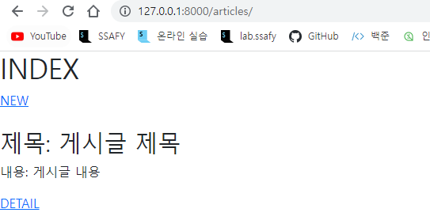
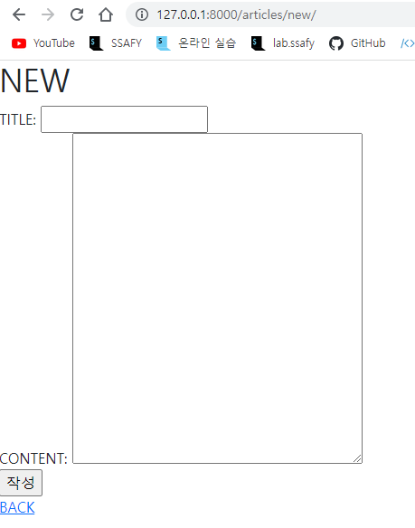
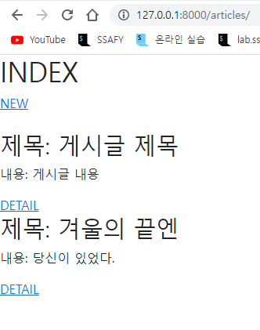

# Model

❖ Article CR (CREATE & READ) CR을 갖춘 장고 프로젝트를 제작하고, 결과 사진과 핵심 코드(url, view, template, model)를 별도의 마크다운 파일에 작성하여 제출하시오. 







1. **articles/urls**

```python
from django.urls import path
from . import views

app_name = 'articles'
urlpatterns = [
    path('', views.index, name='index'),
    path('new/', views.new, name='new'),
    path('create/', views.create, name='create')
]
```

2. **articles/views**

```python
from django.shortcuts import render, redirect
from .models import Article

# Create your views here.
def index(request):
    articles = Article.objects.all()
    context={
        'articles':articles,
    }
    return render(request, 'articles/index.html', context)

def new(request):
    return render(request, 'articles/new.html')

def create(request):
    title = request.GET.get('title')
    content = request.GET.get('content')
    
    article = Article(title=title, content=content)
    article.save()
    return redirect('articles:index')
```

3. **articles/models**

```python
from django.db import models

# Create your models here.
class Article(models.Model):
    title = models.CharField(max_length=20)
    content = models.TextField()
    created_at = models.DateTimeField(auto_now_add=True)
    updated_at = models.DateTimeField(auto_now=True)
```

4. **articles/templates/articles/index.html**

```html



    <h1>INDEX</h1>
    <a href="">NEW</a><br>
    
        <br>
        <h2>제목: {{article.title}}</h2>
        <p>내용: {{article.content}}</p>
        <a href="#">DETAIL</a>
    

```

5. **articles/templates/articles/new.html**

```html



    <h1>NEW</h1>
    <form action="" method="GET">
        <label for="title">TITLE: </label>
        <input type="text" id='title' name='title'><br>
        <label for="content">CONTENT: </label>
        <textarea name="content" id="content" cols="40" rows="15"></textarea><br>
        <input type="submit" value="작성"><br>
        <a href="">BACK</a>
    </form>

```

6. **crud/urls**

```python
from django.contrib import admin
from django.urls import path, include

urlpatterns = [
    path('admin/', admin.site.urls),
    path('articles/', include('articles.urls')),
]
```

**7.templates/**

```html
<!DOCTYPE html>
<html lang="en">
<head>
    <meta charset="UTF-8">
    <meta http-equiv="X-UA-Compatible" content="IE=edge">
    <meta name="viewport" content="width=device-width, initial-scale=1.0">
    <link href="https://cdn.jsdelivr.net/npm/bootstrap@5.2.0/dist/css/bootstrap.min.css" rel="stylesheet" integrity="sha384-gH2yIJqKdNHPEq0n4Mqa/HGKIhSkIHeL5AyhkYV8i59U5AR6csBvApHHNl/vI1Bx" crossorigin="anonymous">
    <title>Document</title>
</head>
<body>
    
    
    <script src="https://cdn.jsdelivr.net/npm/bootstrap@5.2.0/dist/js/bootstrap.bundle.min.js" integrity="sha384-A3rJD856KowSb7dwlZdYEkO39Gagi7vIsF0jrRAoQmDKKtQBHUuLZ9AsSv4jD4Xa" crossorigin="anonymous"></script>
</body>
</html>
```

