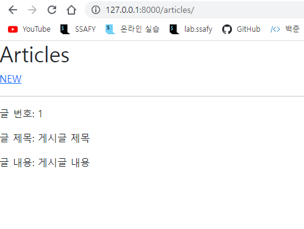
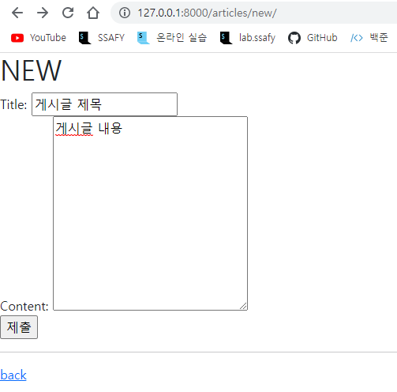
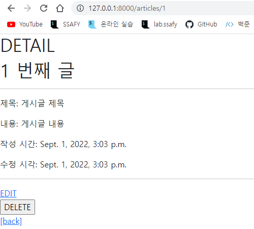
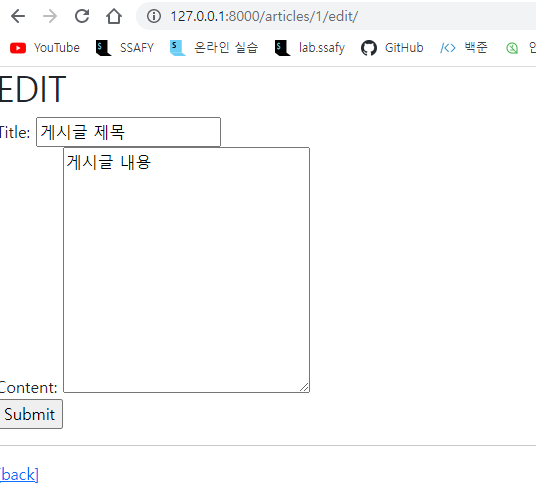

# Model

CRUD를 모두 갖춘 장고 프로젝트를 제작하고 결과 사진과 코드(url, view, template, model)  를 별도의 마크다운 파일에 작성하여 제출하시오.











1) **articles/urls**

```python
from django.urls import path
from . import views

app_name = 'articles'
urlpatterns = [
    path('', views.index, name='index'),
    path('new/', views.new, name='new'),
    path('create/',views.create, name='create'),
    path('<int:pk>', views.detail, name='detail'),
    path('<int:pk>/delete/', views.delete, name='delete'),
    path('<int:pk>/edit/', views.edit, name='edit'),
    path('<int:pk>/update/', views.update, name='update'),
]
```

2. **articles/views**

```python
from django.shortcuts import render, redirect
from .models import Article

# Create your views here.
def index(request):
    articles = Article.objects.all()
    context = {
        'articles': articles
    }
    return render(request, 'articles/index.html', context)

def new(request):
    return render(request,'articles/new.html')

def create(request):
    title = request.GET.get('title')
    content = request.GET.get('content')
    article = Article(title=title, content=content)
    article.save()
    return redirect('articles:detail', article.pk)

def detail(request, pk):
    article = Article.objects.get(pk=pk)
    context = {
        'article':article
    }
    return render(request, 'articles/detail.html', context)

def delete(request, pk):
    article = Article.objects.get(pk=pk)
    article.delete()
    return redirect('articles:index')

def edit(request, pk):
    article = Article.objects.get(pk=pk)
    context = {
        'article':article
    }
    return render(request, 'articles/edit.html',context)

def update(request, pk):
    article = Article.objects.get(pk=pk)
    article.title = request.POST.get('title')
    article.content = request.POST.get('content')
    article.save()
    return redirect('articles:detail', article.pk)
```

3. **articles/models**

```python
from django.db import models

# Create your models here.
class Article(models.Model):
    title = models.CharField(max_length=20)
    content = models.TextField()
    created_at = models.DateTimeField(auto_now_add=True)
    updated_at = models.DateTimeField(auto_now=True)
```

4.**articles/templates/detail.html**

```html



  <h1>DETAIL</h1>
  <h1>{{article.pk}} 번째 글</h1>
  <hr>
  <p>제목: {{article.title}}</p>
  <p>내용: {{article.content}}</p>
  <p>작성 시간: {{article.created_at}}</p>
  <p>수정 시각: {{article.updated_at}}</p>
  <hr>
  <a href="">EDIT</a><br>
  <form action="" method="POST">
    
    <input type="submit" value="DELETE">
  </form>
  <a href="">[back]</a>

```

5.**articles/templates/edit.html**

```html



  <h1>EDIT</h1>
  <form action="" method="POST">
    
    <label for="title">Title: </label>
    <input type="text" id='title' name='title' value="{{article.title}}"><br>
    <label for="content">Content: </label>
    <textarea name="content" id="content" cols="30" rows="10" >{{article.content}}</textarea><br>
    <input type="submit" value="Submit">
  <hr>
  <a href="articles:index">[back]</a>
  </form>

```

6.**articles/templates/index.html**

```html



  <h1>Articles</h1>
  <a href="">NEW</a>
  <hr>
  
    <p>글 번호: {{article.pk}}</p>
    <p>글 제목: {{article.title}}</p>
    <p>글 내용: {{article.content}}</p>
    <a href="">DETAIL</a>
  
    <p>게시글 없음</p>
  

```

7.**articles/templates/new.html**

```html



  <h1>NEW</h1>
  <form action="" mothod="GET">
    <label for="title">Title: </label>
    <input type="text" id='title' name='title'><br>
    <label for="content">Content: </label>
    <textarea name="content" id="content" cols="30" rows="10"></textarea><br>
    <input type="submit"><br>
  </form>
  <hr>
  <a href="">back</a>

```

8.**crud/urls**

```python
from django.contrib import admin
from django.urls import path, include

urlpatterns = [
    path('admin/', admin.site.urls),
    path('articles/', include('articles.urls')),
]
```

9.**templates/base.html**

```html
<!DOCTYPE html>
<html lang="en">
<head>
    <meta charset="UTF-8">
    <meta http-equiv="X-UA-Compatible" content="IE=edge">
    <meta name="viewport" content="width=device-width, initial-scale=1.0">
    <link href="https://cdn.jsdelivr.net/npm/bootstrap@5.2.0/dist/css/bootstrap.min.css" rel="stylesheet" integrity="sha384-gH2yIJqKdNHPEq0n4Mqa/HGKIhSkIHeL5AyhkYV8i59U5AR6csBvApHHNl/vI1Bx" crossorigin="anonymous">
    <title>Document</title>
</head>
<body>
    
    
    <script src="https://cdn.jsdelivr.net/npm/bootstrap@5.2.0/dist/js/bootstrap.bundle.min.js" integrity="sha384-A3rJD856KowSb7dwlZdYEkO39Gagi7vIsF0jrRAoQmDKKtQBHUuLZ9AsSv4jD4Xa" crossorigin="anonymous"></script>
</body>
</html>
```

