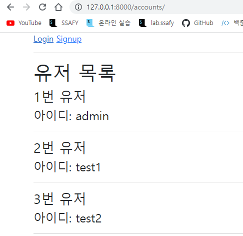
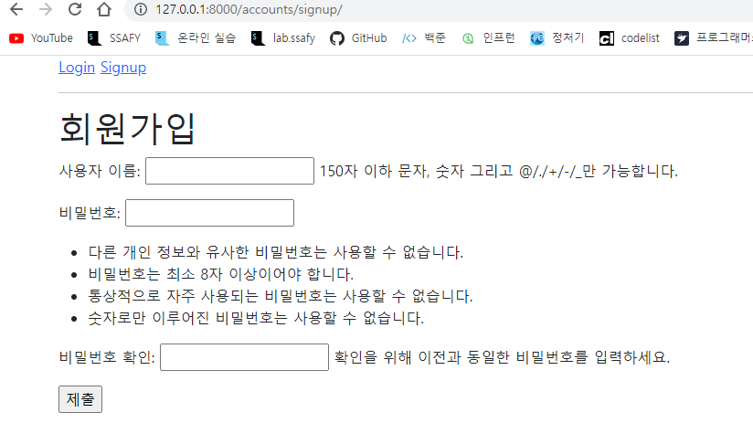

# 05_django_workshop

### 1. /accounts/ 

유저 목록을 출력하는 페이지를 나타낸다.



### 2. /accounts/signup/ 

회원가입 작성을 위한 페이지를 나타낸다. 유저를 생성하는 기능을 수행한다.



### Views.py

```python
from django.shortcuts import render, redirect
from django.contrib.auth.forms import AuthenticationForm, PasswordChangeForm
from django.contrib.auth import update_session_auth_hash
from django.contrib.auth import login as auth_login
from django.contrib.auth import logout as auth_logout
from .forms import CustomUserCreationForm, CustomUserChangeForm
from django.contrib.auth.decorators import login_required
from django.views.decorators.http import require_POST, require_http_methods
from django.contrib.auth import get_user_model

# Create your views here.

@require_http_methods(['GET', 'POST'])
def login(request):
    if request.user.is_authenticated:
        return redirect('articles:index')
    if request.method == "POST":
        form = AuthenticationForm(request, request.POST)
        if form.is_valid():
            auth_login(request, form.get_user())
            return redirect(request.GET.get('next') or "articles:index")
    else:
        form = AuthenticationForm()
    context = {
        'form': form
    }
    return render(request, 'accounts/login.html', context)

@require_POST
def logout(request):
    if request.method == "POST":
        auth_logout(request)
        return redirect('articles:index')

@require_http_methods(['GET', 'POST'])
def signup(request):
    if request.method == "POST":
        form = CustomUserCreationForm(request.POST)
        if form.is_valid():
            user = form.save()
            auth_login(request, user)
            return redirect('articles:index')
    else:
        form = CustomUserCreationForm()
    context={
        'form': form
    }
    return render(request, 'accounts/signup.html', context)

def delete(request):
    request.user.delete()
    auth_logout(request)
    return redirect('articles:index')

@login_required
@require_http_methods(['GET', 'POST'])
def update(request):
    if request.method == "POST":
        form = CustomUserChangeForm(request.POST, instance=request.user)
        if form.is_valid():
            form.save()
            return redirect('articles:index')
    else:
        form = CustomUserChangeForm()
    context = {
        'form':form
    }
    return render(request, 'accounts/update.html', context)

@login_required
@require_http_methods(['GET', 'POST'])
def change_password(request):
    if request.method == "POST":
        form = PasswordChangeForm(request.user, request.POST)
        if form.is_valid():
            form.save()
            update_session_auth_hash(request, form.user)
            return redirect('articles:index')
    else:
        form = PasswordChangeForm(request.user)
    context = {
        'form': form
    }
    return render(request, 'accounts/change_password.html', context)

def index(request):
    User = get_user_model()
    members = User.objects.all()
    context = {
        'members': members
    }
    return render(request, 'accounts/index.html', context)
```

### Index.html

```html



  <h1>유저 목록</h1>
  
    <h3>{{member.pk}}번 유저</h3>
    <h4>아이디: {{member.username}}</h4>
    <hr>
  

```

