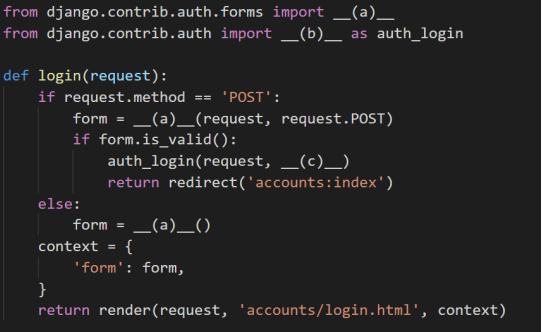
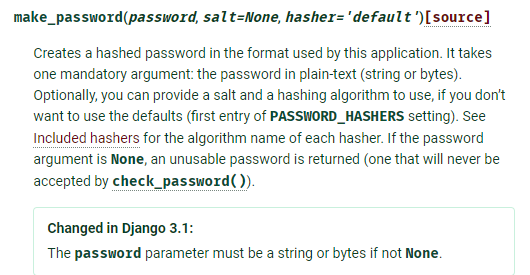
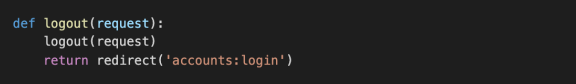

# 06_django_homework

### 1. login validation

단순히 사용자가 ‘로그인 된 사용자인지’만을 확인하기 위하여 사용하는 속성의 이름을 작성 하시오. (User 모델 내부에 정의되어 있음)

```python
request.user.is_authednticated
```

### 2. Login 기능 구현

다음은 로그인 기능을 구현한 코드이다. 빈 칸에 들어갈 코드를 작성하시오.



```txt
(a):CustomUserCreationForm
(b):login
(c):request.user
```

### 3. who are you?

로그인을 하지 않았을 경우 template에서 user 변수를 출력했을 때 나오는 클래스의 이름을 작성하시오.

```txt
AnonymousUser
```

### 4. 암호화 알고리즘

제공된 공식문서를 참고하여 Django에서 기본적으로 User 객체의 password 저장에 사용하는 알고리즘, 그리고 함께 사용된 해시 함수를 찾아서 작성하시오. (참고자료)



```python
make_password(password, salt=None, hasher='default')

PASSWORD_HASHERS = [
    'django.contrib.auth.hashers.Argon2PasswordHasher',
    'django.contrib.auth.hashers.PBKDF2PasswordHasher',
    'django.contrib.auth.hashers.PBKDF2SHA1PasswordHasher',
    'django.contrib.auth.hashers.BCryptSHA256PasswordHasher',
]
```


### 5. Logout 기능 구현

로그아웃 기능을 구현하기 위하여 다음과 같이 코드를 작성하였다. 로그아웃 기능을 실행 시 문제가 발생한다고 할 때 그 이유와 해결 방법을 작성하시오



```python
''' views에서 정의내린 함수의 이름이 logout이므로 django에서 import하여 사용하는 이름과 동일하기 때문에 제대로 동작하기 어렵다. 그렇기에 django에서 사용하는 함수의 이름을 auth_logout처럼 중복되지 않는 이름을 적용하여 기능의 오동작을 피한다'''
from django.contrib.auth import logout as auth_logout
```

