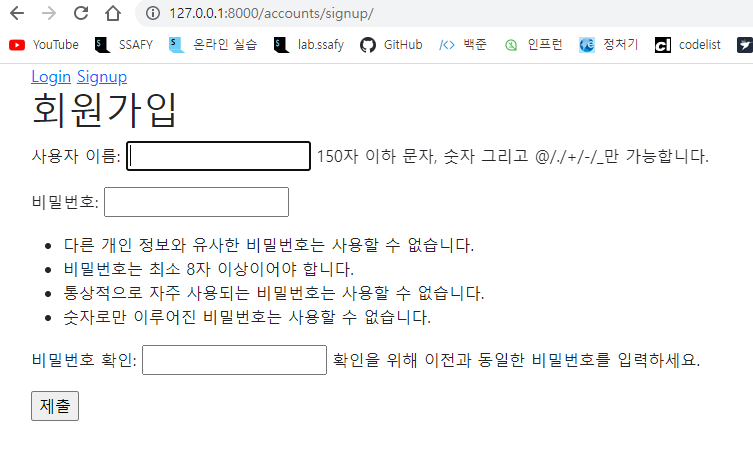
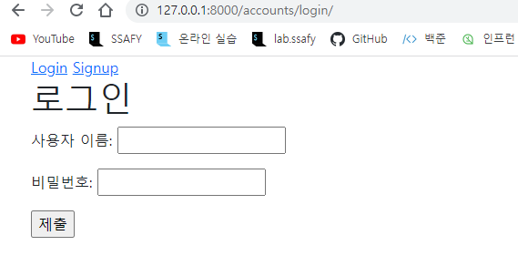
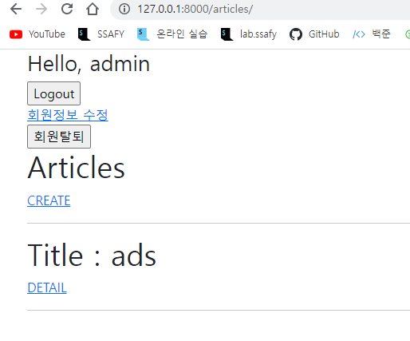
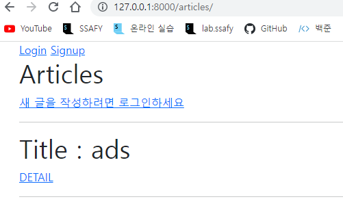
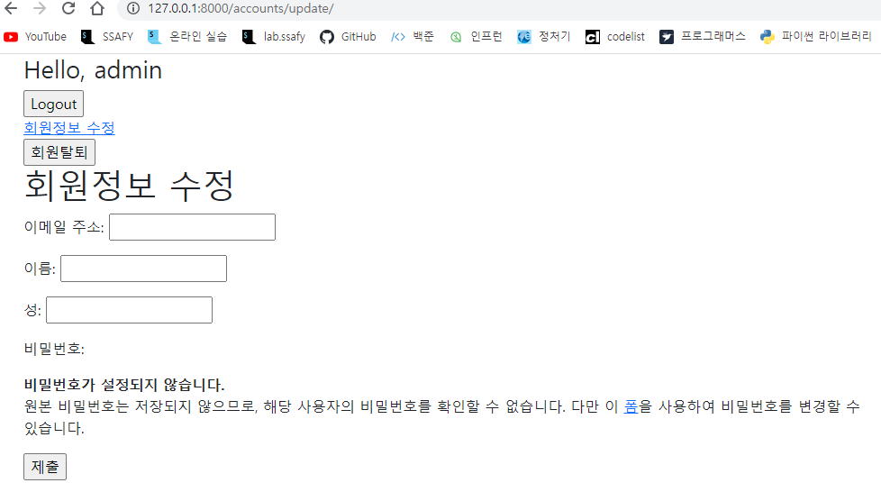
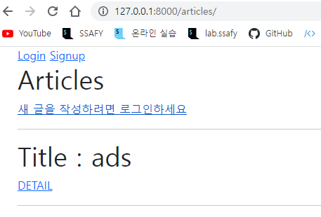

# 06_django_practice

### 1. User Create



### 2. Login





### 3. Logout



### 4. User Update



### 5. User Delete

탈퇴완료



### Views.py

```python
from django.shortcuts import render, redirect
from django.contrib.auth.forms import AuthenticationForm, PasswordChangeForm
from .forms import CustomUserChangeFrom, CustomUserCreationForm
from django.contrib.auth import login as auth_login
from django.contrib.auth import logout as auth_logout
from django.contrib.auth import update_session_auth_hash
from django.views.decorators.http import require_http_methods, require_safe, require_POST

# Create your views here.
@require_http_methods(['GET', 'POST'])
def login(request):
    if request.user.is_authenticated:
        return redirect('articles:index')
    if request.method == 'POST':
        form = AuthenticationForm(request, request.POST)
        if form.is_valid():
            auth_login(request, form.get_user())
            return redirect(request.GET.get('next') or 'articles:index')
    else:
        form = AuthenticationForm()
    context={
        'form':form
    }
    return render(request, 'accounts/login.html', context)

@require_POST
def logout(request):
    auth_logout(request)
    return redirect('articles:index')

@require_http_methods(['GET', 'POST'])
def signup(request):
    if request.method == 'POST':
        form = CustomUserCreationForm(request.POST)
        if form.is_valid():
            user = form.save()
            auth_login(request, user)
            return redirect('articles:index')
    else:
        form = CustomUserCreationForm()
    context = {
        'form': form
    }
    return render(request, 'accounts/signup.html', context)

@require_POST
def delete(request):
    if request.method == "POST":
        request.user.delete()
        auth_logout(request)
        return redirect('articles:index')

@require_http_methods(['GET', 'POST'])
def update(request):
    if request.method == 'POST':
        form = CustomUserChangeFrom(request.POST, instance = request.user)
        if form.is_valid():
            form.save()
            return redirect('articles:index')
    else:
        form = CustomUserChangeFrom(instance = request.user)
    context = {
        'form':form
    }
    return render(request, 'accounts/update.html', context)

@require_http_methods(['GET', 'POST'])
def change_password(request):
    if request.method == "POST":
        form = PasswordChangeForm( request.user, request.POST)
        if form.is_valid():
            form.save()
            update_session_auth_hash(request, form.user)
            return redirect('articles:index')
    else:
        form = PasswordChangeForm(request.user)
    context = {
        'form':form
    }
    return render(request,'accounts/change_password.html', context)
```

### login.html

```html



  <h1>로그인</h1>
  <form action="" method="POST">
    
    {{form.as_p}}
    <input type="submit">
  </form>

```

### signup.html

```html



  <h1>회원가입</h1>
  <form action="" method="POST">
    
    {{form.as_p}}
    <input type="submit">
  </form>

```

### update.html

```html



  <h1>회원정보 수정</h1>
  <form action="" method="POST">
    
    {{form.as_p}}
    <input type="submit">
  </form>

```

### urls.py

```python
from django.urls import path
from . import views

app_name = 'accounts'
urlpatterns = [
    path('login/', views.login, name='login'),
    path('logout/', views.logout, name='logout'),
    path('signup/', views.signup, name='signup'),
    path('delete/', views.delete, name='delete'),
    path('update/', views.update, name="update"),
    path('password/', views.change_password, name='change_password'),
]
```

### forms.py

```python
from django.contrib.auth import get_user_model
from django.contrib.auth.forms import UserChangeForm, UserCreationForm

class CustomUserCreationForm(UserCreationForm):
    
    class Meta(UserCreationForm.Meta):
        model = get_user_model()

class CustomUserChangeFrom(UserChangeForm):
    
    class Meta(UserChangeForm.Meta):
        model = get_user_model()
        fields = ('email', 'first_name', 'last_name')
```

