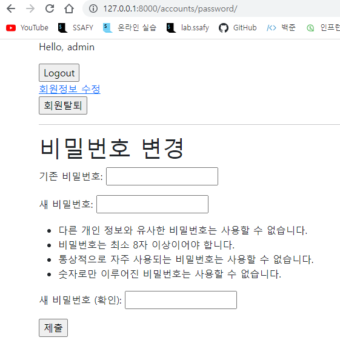

# 06_django_workshop

### 1. User Change Password

/accounts/password/ 형식의 url을 가지며, 유저의 비밀번호 수정 기능을 구현한다.



### views.py

```python
from django.shortcuts import render, redirect
from django.contrib.auth.forms import AuthenticationForm, PasswordChangeForm
from django.contrib.auth.decorators import login_required
from django.views.decorators.http import require_POST, require_http_methods

@login_required
@require_http_methods(['GET', 'POST'])
def change_password(request):
    if request.method == "POST":
        form = PasswordChangeForm(request.user, request.POST)
        if form.is_valid():
            form.save()
            update_session_auth_hash(request, form.user)
            return redirect('articles:index')
    else:
        form = PasswordChangeForm(request.user)
    context = {
        'form': form
    }
    return render(request, 'accounts/change_password.html', context)
```

### change_password.html

```html



  <h1>비밀번호 변경</h1>
  <form action="" method="POST">
    
    {{form.as_p}}
    <input type="submit">
  </form>

```

