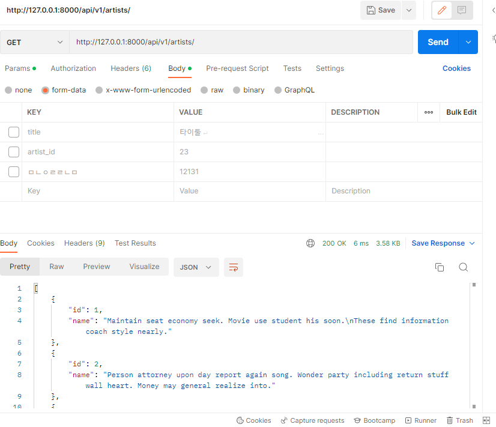
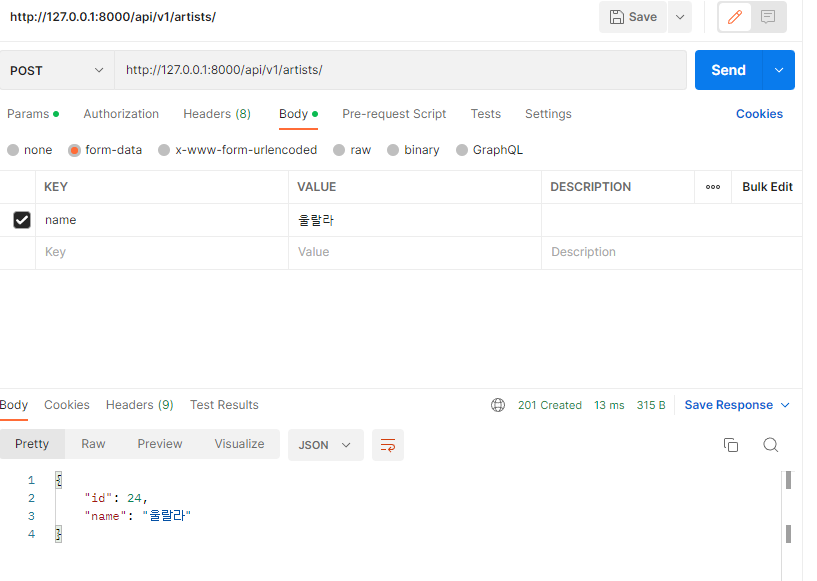
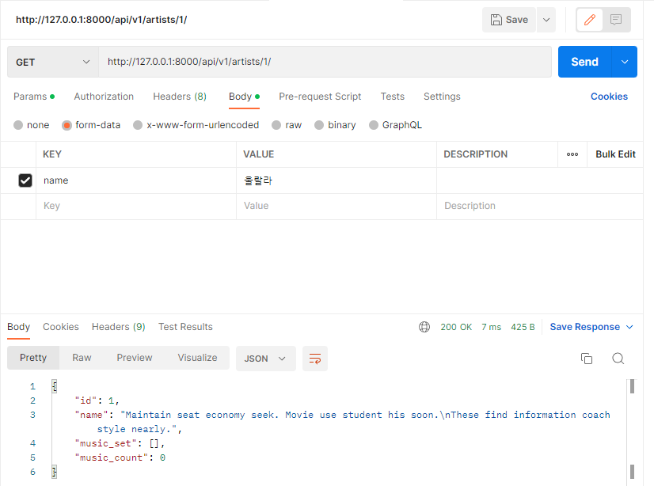
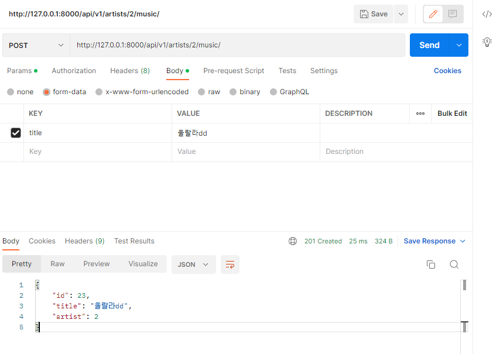
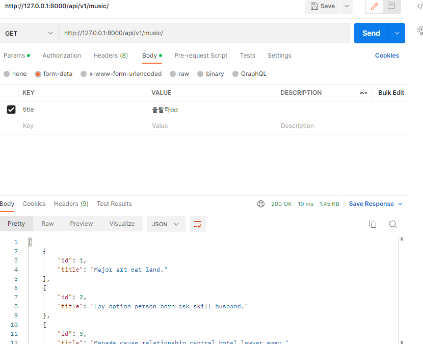
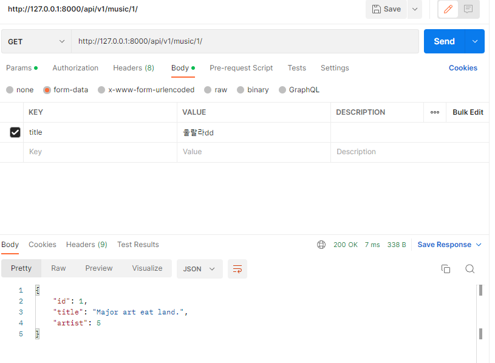
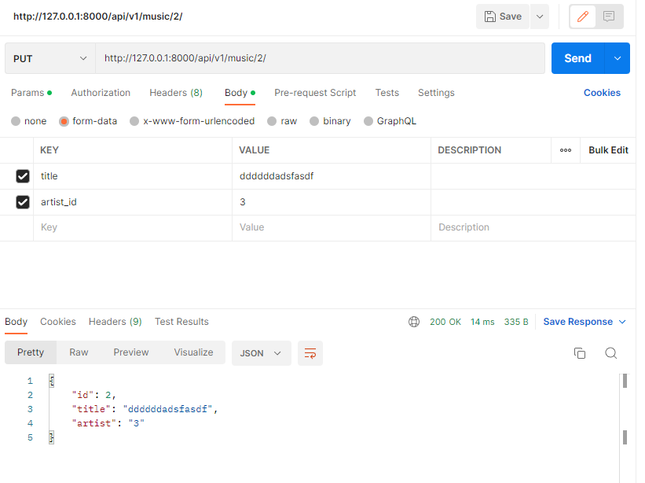
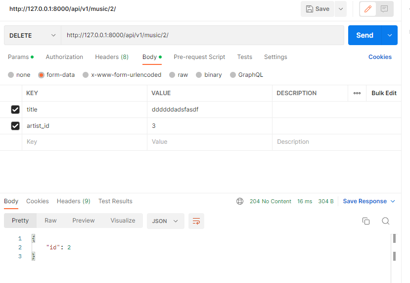

# Django REST Framework

### 1. 각 요청에 해당하는 JSON 응답 결과와 views.py, serializers.py 코드를 마크다운에 작성하여 제출하시오

- GET api/v1/artists/



- POST api/v1/artists/



- GET api/v1/artists//



- POST api/v1/artists//music/



- GET api/v1/music/



- GET & PUT & DELETE api/v1/music/







```python
#views.py
from django.shortcuts import render, get_list_or_404, get_object_or_404
from rest_framework.response import Response
from rest_framework.decorators import api_view
from rest_framework import status
from .serializers import ArtistListSerializer, ArtistSerializer, MusicListSerializer, MusicSerializer
from .models import Music, Artist

# Create your views here.

@api_view(['GET', 'POST'])
def artist_list(request):
    if request.method=="GET":
        artists = get_list_or_404(Artist)
        serializer = ArtistListSerializer(artists, many=True)
        return Response(serializer.data)
    
    elif request.method =="POST":
        serializer = ArtistListSerializer(data=request.data)
        if serializer.is_valid(raise_exception=True):
            serializer.save()
            return Response(serializer.data, status=status.HTTP_201_CREATED)

@api_view(['GET'])
def artist_detail(request, artist_pk):
    if request.method=="GET":
        artist = Artist.objects.get(pk=artist_pk)
        serializer = ArtistSerializer(artist)                       # artist의 정보를 Serialize화 한 후 JSON으로 응답
        return Response(serializer.data)
    
@api_view(['POST'])
def music_create(request, artist_pk):
    artist = Artist.objects.get(pk=artist_pk)
    serializer = MusicSerializer(data = request.data)
    if serializer.is_valid(raise_exception=True):
        serializer.save(artist=artist)
        return Response(serializer.data,status=status.HTTP_201_CREATED)

@api_view(['GET'])
def music_list(request):
    musics = Music.objects.all()
    serializer = MusicListSerializer(musics, many=True)
    return Response(serializer.data)

@api_view(['GET', 'PUT', 'DELETE'])
def music_detail(request, music_pk):
    music = get_object_or_404(Music, pk=music_pk)
    print(f'artist 번호?? {music.artist}')
    if request.method=='GET':
        serializer = MusicSerializer(music)
        return Response(serializer.data)
    
    elif request.method=="PUT":
        serializer = MusicSerializer(music, data=request.data)
        if Artist.objects.filter(pk=request.data.get('artist_id')).exists():
            if serializer.is_valid(raise_exception=True):
                serializer.save(artist_id = request.data['artist_id'])
                return Response(serializer.data)
        else:
            return Response(status=status.HTTP_204_NO_CONTENT)
    
    elif request.method=="DELETE":
        music.delete()
        return Response({'id': music_pk},status=status.HTTP_204_NO_CONTENT)
    
    
# serializers.py
from rest_framework import serializers
from .models import Music, Artist

class MusicListSerializer(serializers.ModelSerializer):

    class Meta:
        model = Music
        fields = ('id', 'title')


class MusicSerializer(serializers.ModelSerializer):

    class Meta:
        model = Music
        fields = ('id', 'title', 'artist')
        read_only_fields = ('artist',)


class ArtistListSerializer(serializers.ModelSerializer):

    class Meta:
        model = Artist
        fields = ('id', 'name',)


class ArtistSerializer(serializers.ModelSerializer):
    music_set = MusicSerializer(many=True, read_only=True)# put, post필드
    music_count = serializers.IntegerField(source = 'music_set.count', read_only=True)  # read_only기능이 무엇인지?

    class Meta:
        model = Artist
        fields = ('id', 'name', 'music_set', 'music_count',)

```

