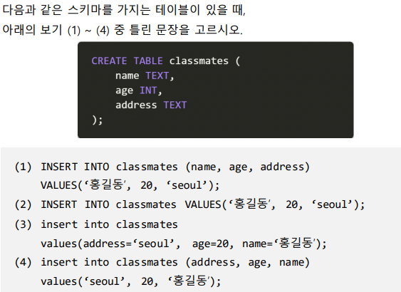

# SQL

### 1. SQL 용어 및 개념

아래의 보기에서 각 문항의 설명에 맞는 용어를 고르시오. 

1) 관계형 데이터베이스에서 구조와 제약조건에 관련한 전반적인 명세를 기술 한 것 

- 스키마

2. 열과 행의 모델을 사용해 조직된 데이터 요소들의 집합 

- 테이블

3. 고유한 데이터 형식이 지정되는 열 

- 컬럼

4. 단일 구조 데이터 항목을 가리키는 행 

- 레코드

5. 각 행의 고유 값

- 기본 키

### 2. SQL 문법

( 1 ) CREATE는 DDL의 구성 요소 중 하나이다.

### 3. Relational DBMS

- Relational Database Management system으로 관계형 데이터베이스를 만들고 업데이트하고 관리하는 데 사용하는 프로그램
- DB-Engine: MySQL, Oracle, SQLite 등

### 4. INSERT INTO

(3) INSERT 문은 3번과 같은 형식을 가지고 있지 않다.

### 5. 와일드카드 문자

%: 길이의 제한 없이 시작 또는 끝을 지정하여 문자열을 찾아냄

_: 길이의 제한을 두어서 해당 문자열을 찾아냄

예시) 영% -> 영, 영미, 영미리 등

​          한_ -> 한국, 한자 등

