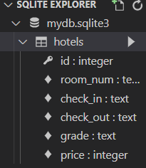
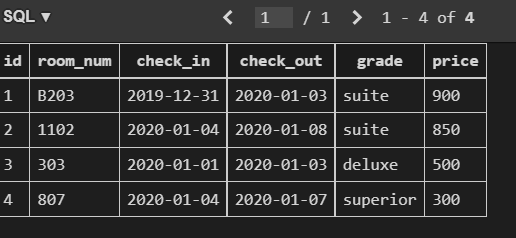
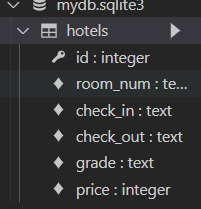
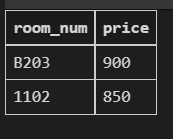
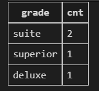
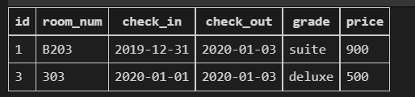
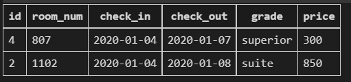

# SQL

### 1. SQL Query

위 countries 테이블을 바탕으로 아래 문제에 해당하는 SQL query문을 작성하고 실행하시오.

1) countries 테이블을 생성하시오. 

```sql
CREATE TABLE countries (
  id INTEGER PRIMARY KEY,
  room_num TEXT NOT NULL,
  check_in TEXT NOT NULL,
  check_out TEXT NOT NULL,
  grade TEXT NOT NULL,
  price INTEGER NOT NULL
);
```



2. 데이터를 입력하시오.

```sql
INSERT INTO countries
VALUES
 (1, 'B203', '2019-12-31', '2020-01-03', 'suite', 900),
 (2, '1102', '2020-01-04', '2020-01-08', 'suite', 850),
 (3, '303', '2020-01-01', '2020-01-03', 'deluxe', 500),
 (4, '807', '2020-01-04', '2020-01-07', 'superior', 300);
```



3. 테이블의 이름을 hotels로 변경하시오.

```sql
ALTER TABLE countries RENAME TO hotels;
```



4. 객실 가격을 내림차순으로 정렬하여 상위 2개의 room_num과 price를 조회하시오.

```sql
SELECT room_num, price 
FROM hotels 
ORDER BY price DESC
LIMIT 2;
```



5. grade 별로 분류하고 분류된 grade 개수를 내림차순으로 조회하시오.

```sql
SELECT grade, COUNT(*) AS cnt 
FROM hotels GROUP BY grade 
ORDER BY cnt DESC;
```



6. 객실의 위치가 지하 혹은 등급이 deluxe인 객실의 모든 정보를 조회하시오.

```sql
SELECT * FROM hotels
WHERE room_num LIKE 'B%' OR grade = 'deluxe';
```



7. 지상층 객실이면서 2020년 1월 4일에 체크인 한 객실의 목록을 price 오름차순으로 조회하시오

```sql
SELECT * FROM hotels
WHERE room_num NOT IN ('B%') AND check_in = '2020-01-04'
ORDER BY price;
```


