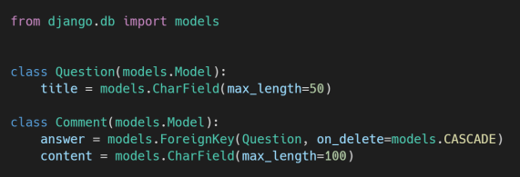
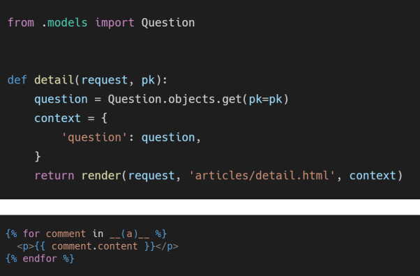

# Django Model Relationship

### 1. N:1 True or False

각 문항을 읽고 맞으면 T, 틀리면 F를 작성하고 틀렸다면 그 이유도 함께 작성하시오.

1. ForeignKey는 부모 테이블의 데이터를 참조하기 위한 키이다. **(T)**

2) N:1 관계에서 1은 N의 데이터를 직접 참조 할 수 있다. **(F)**

> N은 1의 데이터를 참조하지만 1은 N의 데이터를 참조할 수 없어서 역참조라는 특수한 기능을 사용한다.

3) on_delete 속성은 ForeignKey 필드의 필수 인자이다. **(T)**

> 외래 키가 참조하는 객체가 사라졌을 때, 외래 키를 가진 객체를 어떻게 할지 정의해야하는 것이 데이터 무결성을 지키기 위해 매우 중요

4) N:1 관계에서 외래 키는 반드시 부모 테이블의 PrimaryKey여야 한다. **(F)**

> 반드시 기본 키일 필요는 없으며 단지 유일성을 만족시켜야 함. 예를 들면 대체키가 해당될듯.


### 2. ForeignKey column name



1) ForeignKey 컬럼의 이름: answer_id
2) 테이블의 이름: articles_comment


### 3. N:1 model manager



a: question.comment_set.all()


### 4. next parameter

1) redirect된 로그인 페이지에서 로그인에 성공했을 때 발생하는 HTTP response status  code를 작성하고, 이 오류가 발생한 원인을 작성하시오.

```txt
로그인 성공 시, delete함수를 진행하게 되지만 @require_POST로 인해 405 상태 코드를 받게 된다.
405(Method Not Allowed) status code
```

2) 위에서 발생한 오류를 해결하기 위해 다음과 같이 동작하는 코드로 수정하시오.

 ▪ 게시글 삭제는 HTTP POST method로만 가능하다. 

 ▪ 인증되지 않은 사용자가 게시글 삭제를 시도하는 경우, 해당 게시글 상세페이지로 redirect 되도록 한다. (게시글은 삭제되지 않는다.

```python
@require_POST
def delete(request, article_pk):
    if request.user.is_authenticated:
        article = get_object_or_404(Article, pk=article_pk)
        article.delete()
        return redirect('articles:index')
    return redirect('articles:detail', article_pk)
```

