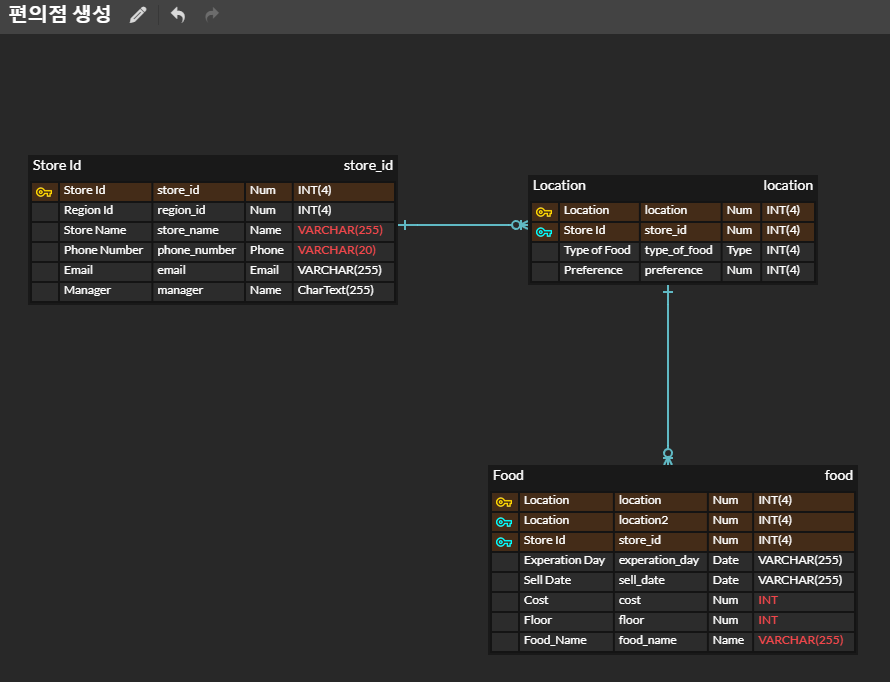

# Django Model Relationship

### 1. User Model BooleanField

```python
is_staff = models.BooleanField(
        _("staff status"),
        default=False,
        help_text=_("Designates whether the user can log into this admin site."),
    )

is_active = models.BooleanField(
    _("active"),
    default=True,
    help_text=_(
        "Designates whether this user should be treated as active. "
        "Unselect this instead of deleting accounts."
    ),
```

### 2. ERD




Store Id: 편의점 별로 고유 아이디를 가지기에 해당 필드를 기본 키로 설정.
나머지 부가적인 속성은 지역 정보, 가게 이름, 전화번호, email, 메니저 등으로 구성됨

Location: 편의점 내부의 상품 위치, 종류, 선호도를 나타냄.
특히 위치는 고유한 값을 가지므로 해당 값을 기본키로 설정.

Food:  선반의 층, 가격, 이름, 유통기한, 판매날짜등으로 속성을 구분함


Store Id   1->N    Location    1 -> N   Food

와 같은 1대 N관계를 가진다.


