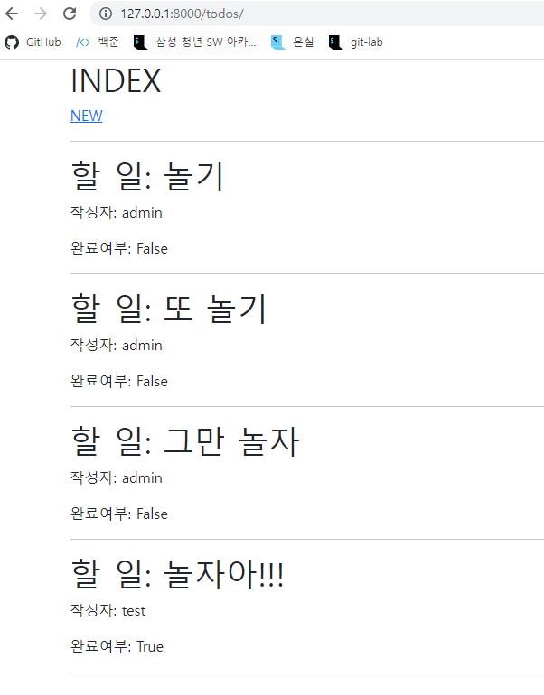

# Model Relationship

### todo

```python
#todos/views.py

from django.shortcuts import render, redirect
from .models import Todos
from .forms import TodosForm
from django.contrib.auth.decorators import login_required

# Create your views here.
@login_required
def index(request):
    todos = Todos.objects.all()
    context = {
        'todos': todos
    }
    return render(request, 'todos/index.html', context)

@login_required
def create(request):
    if request.method == "POST":
        todos_form = TodosForm(request.POST)
        if todos_form.is_valid():
            todo = todos_form.save(commit=False)
            todo.user = request.user
            todo.save()
            return redirect('todos:index')
    else:
        todos_form = TodosForm()
    context = {
        'todos_form':todos_form,
    }
    return render(request, 'todos/create.html',context)

#todos/urls.py
from django.urls import path
from . import views

app_name='todos'
urlpatterns = [
    path('', views.index, name='index'),
    path('new/', views.create, name='create'),
]

#todos/models.py
from django.db import models
from django.conf import settings

# Create your models here.
class Todos(models.Model):
    user = models.ForeignKey(settings.AUTH_USER_MODEL, on_delete=models.CASCADE)
    title = models.CharField(max_length=30)
    completed = models.BooleanField(default = False)
    created_at = models.DateTimeField(auto_now_add=True)
    updated_at = models.DateTimeField(auto_now=True)

#todos/forms.py
from django import forms
from .models import Todos

class TodosForm(forms.ModelForm):

    class Meta:
        model = Todos
        # fields = '__all__'
        exclude = ('user',)

#index.html



  <h1>INDEX</h1>
  <a href="">NEW</a>
  <hr>
  
    <h1>할 일: {{ todo.title }}</h1>
    <p>작성자: {{ todo.user }}</p>
    <p>완료여부: {{ todo.completed }}</p>
    <hr>
  
    <p>게시글이 작성되지 않았습니다.</p>
  


#create.html



  <h1>NEW</h1>
  <form action="" method="POST">
    
    {{ todos_form.as_p }}
    <input type="submit" value='NEW'>
  </form>

```




```python
#accounts/views.py
from django.shortcuts import render, redirect
from django.contrib.auth.forms import AuthenticationForm
from django.contrib.auth import login as auth_login
from .forms import CustomUserChangeForm, CustomUserCreationForm

# Create your views here.
def login(request):
    if request.method == 'POST':
        form = AuthenticationForm(request, request.POST)
        if form.is_valid():
            auth_login(request, form.get_user())
            return redirect(request.GET.get('next') or 'todos:index')
    else:
        form = AuthenticationForm()
    context = {
        'form': form
    }
    return render(request, 'accounts/login.html', context)

def signup(request):
    if request.method == "POST":
        form = CustomUserCreationForm(request.POST)
        if form.is_valid():
            user = form.save()
            auth_login(request, user)
            return redirect('todos:index')
    else:
        form = CustomUserCreationForm()
    context = {
        'form': form
    }
    return render(request, 'accounts/signup.html', context)

#accounts/urls.py
from django.urls import path
from . import views

app_name = 'accounts'
urlpatterns = [
    path('login/', views.login, name='login'),
    path('signup/', views.signup, name='signup'),
]

#accounts/models.py
from django.db import models
from django.contrib.auth.models import AbstractUser

# Create your models here.

class User(AbstractUser):
    pass

#accounts/forms.py
from django.contrib.auth import get_user_model
from django.contrib.auth.forms import UserChangeForm, UserCreationForm

class CustomUserCreationForm(UserCreationForm):

    class Meta(UserCreationForm.Meta):
        model = get_user_model()

class CustomUserChangeForm(UserChangeForm):

    class Meta(UserChangeForm.Meta):
        model = get_user_model()
#accounts/login.html



  <h1>Login</h1>
  <form action="#" method="POST">
    
    {{ form.as_p }}
    <input type="submit" value="login">
  </form>
  <a href="">signup</a>


#accounts/signup.html



  <h1>Sign Up</h1>
  <form action="" method="POST">
    
    {{ form.as_p }}
    <input type="submit" value="SignUp!">
  </form>


```


