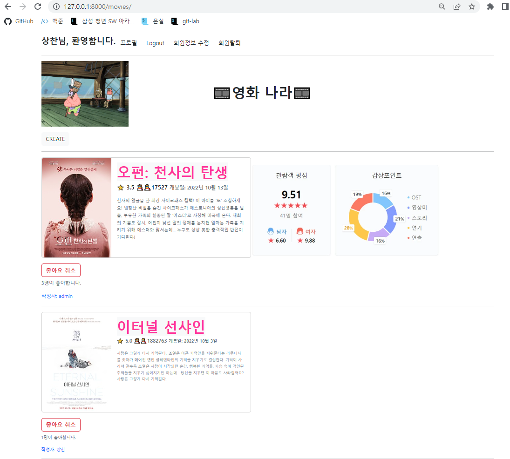
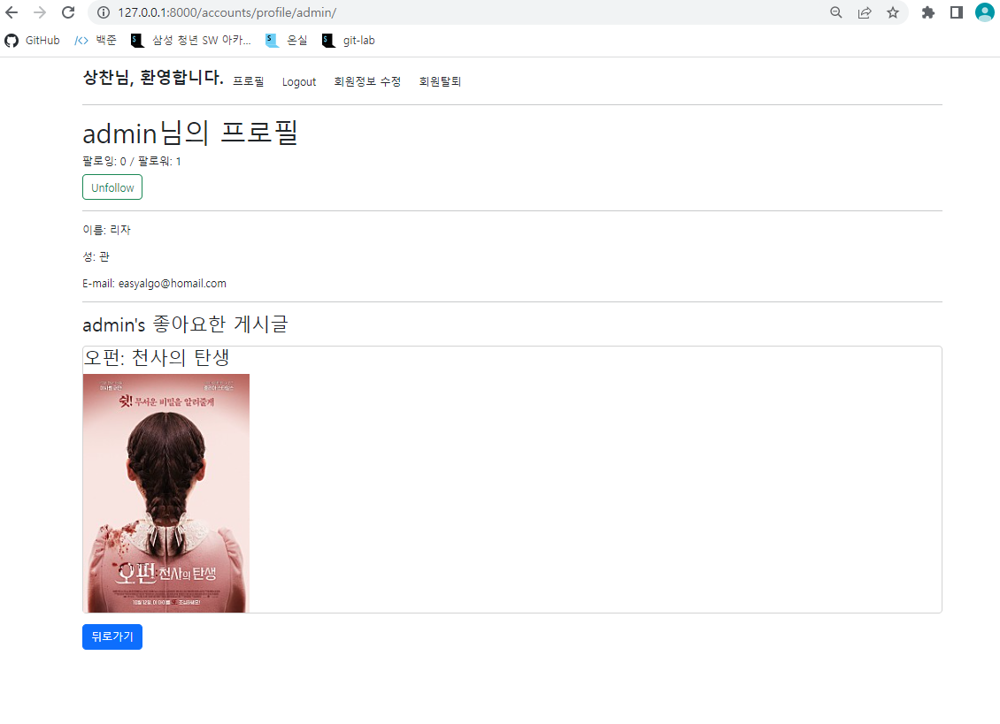

# Django Model Relationship





### accounts/views.py

```python
#accounts/views.py

from django.shortcuts import render, redirect
from django.contrib.auth.forms import AuthenticationForm, PasswordChangeForm
from django.contrib.auth import login as auth_login
from django.contrib.auth import logout as auth_logout
from django.contrib.auth import update_session_auth_hash
from django.contrib.auth.decorators import login_required
from django.views.decorators.http import require_POST, require_http_methods
from django.contrib.auth import get_user_model


from .forms import CustomUserCreationForm, CustomUserChangeForm

# Create your views here.
@require_http_methods(['GET', 'POST'])
def login(request):
    if request.user.is_authenticated:
        return redirect('movies:index')
    if request.method == "POST":
        form = AuthenticationForm(request, request.POST)
        if form.is_valid():
            auth_login(request, form.get_user())
            return redirect(request.GET.get('next') or 'movies:index')
    else:
        form = AuthenticationForm()
    context = {
        'form': form
    }
    return render(request, 'accounts/login.html', context)

@require_POST
def logout(request):
    if request.user.is_authenticated:
        auth_logout(request)
    return redirect('movies:index')

@require_http_methods(['GET', 'POST'])
def signup(request):
    if request.method=="POST":
        form = CustomUserCreationForm(request.POST)
        if form.is_valid():
            user = form.save()
            auth_login(request, user)
            return redirect('movies:index')
    else:
        form = CustomUserCreationForm
    context = {
        'form': form
    }
    return render(request, 'accounts/signup.html', context)

def delete(request):
    request.user.delete()
    auth_logout(request)
    return redirect('movies:index')

@login_required
@require_http_methods(['GET', 'POST'])
def update(request):
    if request.method == "POST":
        form = CustomUserChangeForm(request.POST, instance=request.user)
        if form.is_valid():
            form.save()
            return redirect('movies:index')
    else:
        form = CustomUserChangeForm(instance=request.user)
    context = {
        'form': form
    }
    return render(request, 'accounts/update.html' ,context)

@login_required
@require_http_methods(['GET', 'POST'])
def change_password(request):
    if request.method == "POST":
        form = PasswordChangeForm(request.POST)
        if form.is_valid():
            form.save()
            update_session_auth_hash(request, form.user)
            return redirect('movies:index')
    else:
        form = PasswordChangeForm(request.user)
    context = {
        'form':form,
    }
    return render(request, 'accounts/change_password.html', context)


def profile(request, username):
    user = get_user_model()
    person = user.objects.get(username=username)
    context = {
        'person': person
    }
    return render(request, 'accounts/profile.html', context)


@require_POST
def follow(request, user_pk):
    if request.user.is_authenticated:
        user = get_user_model()
        person = user.objects.get(pk = user_pk)
        if person != request.user:
            if person.followers.filter(pk = request.user.pk).exists():
                person.followers.remove(request.user)
            else:
                person.followers.add(request.user)
        return redirect('accounts:profile', person.username)
    return redirect('accounts:login')
```


### accounts/models.py

```python
from django.db import models
from django.contrib.auth.models import AbstractUser

# Create your models here.
class User(AbstractUser):
    followings = models.ManyToManyField('self', symmetrical=False, related_name='followers')
```


### profile.html

```python



  <h1>{{ person.username }}님의 프로필</h1>
  <div>
    팔로잉: {{ person.followings.all.count }} / 팔로워: {{ person.followers.all.count }}
  </div>
  
    <div>
        <form action="" method="POST">
            
            
              <input type="submit" value="Unfollow" class="btn btn-outline-success mt-2">
            
              <input type="submit" value="Follow" class="btn btn-outline-success mt-2">            
            

        </form>
    </div>
  
  <hr>
  <p>이름: {{ person.first_name }}</p>
  <p>성: {{ person.last_name }}</p>
  <p>E-mail: {{ person.email }}</p>
  <hr>
  <h3>{{ person.username }}'s 좋아요한 게시글</h3>
  
    <div class="card mt-3" >
      <h3> {{ movie.title }} </h3>
      
    </div>
  
    <p>좋아요한 게시글이 없습니다.</p>
  
  <div class="mt-3">
    <a href="" class="btn btn-primary">뒤로가기</a>
  </div>

```

